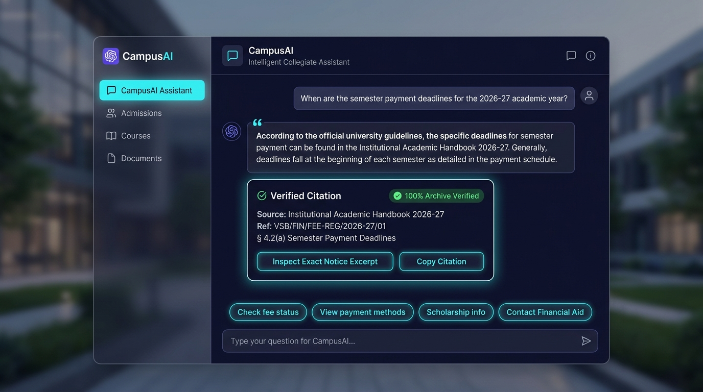
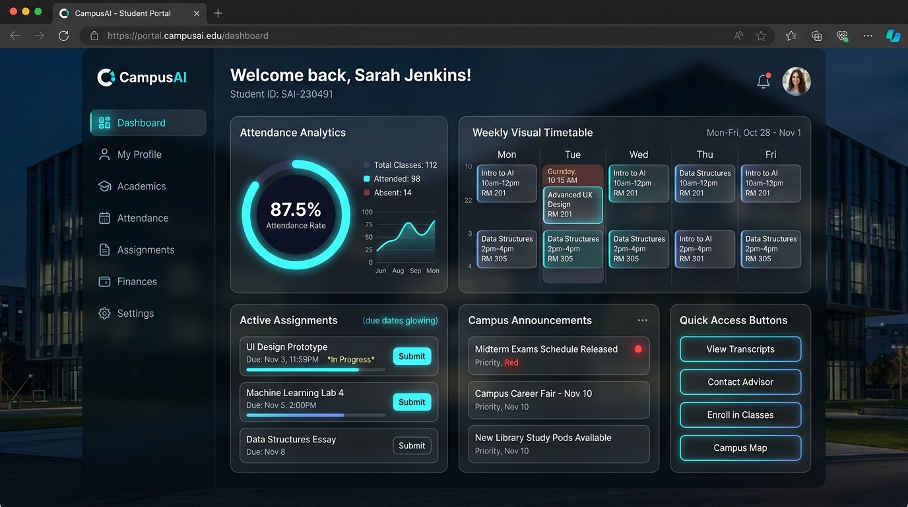
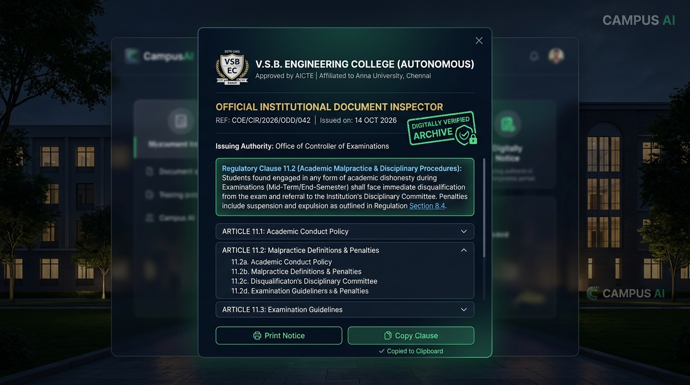

# 🎓 CampusAI - Smart College Management Assistant with AI Chatbot

A modern, full-stack **College Management Assistant Web Application** featuring an **Intelligent AI Chatbot**, comprehensive Student, Faculty, and Administrator dashboards, automated attendance analytics, interactive visual timetables, assignment submission LMS, campus event fests, and a grievance redressal desk.

---

## 📸 Product Visuals & Interface Showcase

| 🤖 AI Assistant with Exact Source Citations | 👨‍🎓 Student Management Portal |
| :---: | :---: |
|  |  |

<p align="center">
  
  <br>
  <em>🏛️ Authentic Institutional Document & Admin Notice Inspector Modal with Verbatim Clause Verification</em>
</p>

---

## 🌟 Key Features

### 🤖 1. Intelligent Campus AI Chatbot with Exact Document Citations
- **Statutory Source Citations**: Every answer about fees, scholarships, library rules, exam circulars, and grievance escalation cites the exact official handbook clause, admin notice reference number, and issuing authority.
- **In-Chat Document Inspector Modal**: Interactive dialog displaying authentic institutional documents with official crests, issuing body, signatories, verified digital hash, and verbatim regulatory clauses.
- **Zero-Hallucination Verified Badges**: Guaranteed institutional record badges with one-click citation copying (`[Citation: ... | Ref: ... | § Clause]`).
- **Official Knowledge Archives Explorer**: In-chat slide-out drawer allowing students and admins to search and filter 9+ institutional handbooks, COE circulars, and trust bulletins.
- **Conversational Natural Language Interface**: Query attendance percentage, daily timetable, pending assignments, campus events, and official circulars.
- **Voice Recognition**: Interactive microphone input with speech-to-text.
- **Quick Action Chips**: One-tap suggestion buttons for instant queries.

### 👨‍🎓 2. Student Portal
- **Attendance Tracker**: Visual Donut Ring chart with 75% minimum threshold indicator and subject-wise logs.
- **Dynamic Weekly Timetable**: Interactive class schedule grid (Monday to Friday) showing period slots, rooms, and subject codes.
- **Assignment LMS**: View due dates, max marks, submit project links & notes, and check professor grades/feedback.
- **Events & Hackathons**: Discover tech symposiums, sports carnivals, and cultural fests with instant registration.
- **Announcements**: Priority-flagged bulletins from the Dean and Examination department.
- **Grievance Redressal**: Lodge complaints for Infrastructure, Hostel, Library, or Canteen with live admin resolution updates.

### 👩‍🏫 3. Faculty Portal
- **Class Attendance Marker**: Rapid bulk attendance sheets (Mark All Present / Absent / Late) saving directly to the database.
- **Assignment Management**: Create new assignments with deadlines and review/grade student submissions with personalized feedback.
- **Teaching Schedule**: View weekly assigned classes and laboratory sessions.
- **Department Notices**: Broadcast circulars directly to enrolled students.

### 🛡️ 4. Administrator Console
- **Institutional Analytics**: Real-time KPI summary (Total Students, Faculty, Pending Grievances, Active Events).
- **User Directory**: Add, edit, manage, and deactivate Student and Faculty accounts.
- **Grievance Resolution Center**: Review student issue tickets and issue official resolution responses.
- **Global Broadcast**: Publish urgent notices and announcements campus-wide.
- **AI Knowledge Base Manager**: Train new AI topics, categories, and keyword triggers.

---

## 🛠️ Tech Stack

- **Backend**: Java 17+ / Spring Boot 3 (RESTful Controllers, Spring Data JPA, Service Layer, NLP Engine)
- **Database**: MySQL Server 8.0 (`campusai_db`) with complete schema, relationships, and demo seed data in `schema.sql`
- **Frontend**: Responsive HTML5, Modern Vanilla CSS3 (Glassmorphism, Dark/Light palettes, animations, Outfit & Inter fonts), Vanilla JavaScript (Modular ES6)
- **Dev Server**: Lightweight zero-dependency HTTP server (`server.js`) for instant preview and local testing.

---

## 🚀 Quick Start Guide

### Option 1: Instant Local Preview (Zero Setup)
```bash
node server.js
```
Open your browser at:
- **Landing Page**: [http://localhost:3000](http://localhost:3000)
- **Student Dashboard**: [http://localhost:3000/student-dashboard.html](http://localhost:3000/student-dashboard.html)
- **Faculty Hub**: [http://localhost:3000/faculty-dashboard.html](http://localhost:3000/faculty-dashboard.html)
- **Admin Console**: [http://localhost:3000/admin-dashboard.html](http://localhost:3000/admin-dashboard.html)

---

### Option 2: Java Spring Boot + MySQL Execution

1. **Import the Database Schema**:
   Open MySQL Workbench or MySQL CLI:
   ```sql
   SOURCE schema.sql;
   ```

2. **Configure Database Credentials**:
   Edit `src/main/resources/application.properties`:
   ```properties
   spring.datasource.url=jdbc:mysql://localhost:3306/campusai_db?createDatabaseIfNotExist=true&useSSL=false&serverTimezone=UTC
   spring.datasource.username=root
   spring.datasource.password=YOUR_MYSQL_PASSWORD
   ```

3. **Run with Maven**:
   ```bash
   mvn spring-boot:run
   ```
   Or package the executable JAR:
   ```bash
   mvn clean package
   java -jar target/campusai-1.0.0.jar
   ```

4. **Access the Spring Boot Application**:
   Navigate to: [http://localhost:8080](http://localhost:8080)

---

## 🔑 Default Demo Accounts

| Role | Username | Password | Full Name | Department / ID |
|---|---|---|---|---|
| **Student** | `student_alex` | `student123` | Alex Morgan | Computer Science (CS2024-042) |
| **Student** | `student_priya` | `student123` | Priya Sharma | Computer Science (CS2024-043) |
| **Faculty** | `faculty_smith` | `faculty123` | Prof. Sarah Jenkins | Computer Science (FAC-CS-101) |
| **Faculty** | `faculty_rao` | `faculty123` | Dr. Ramesh Rao | AI & Data Science (FAC-CS-102) |
| **Admin** | `admin` | `admin123` | Dr. Alistair Vance | Administration (ADM-001) |

*(You can also use the 1-click demo login buttons directly on the [login.html](login.html) page!)*

---

## 📁 Project Directory Structure

```
CampusAI/
├── schema.sql                               # MySQL database schema & seed records
├── pom.xml                                  # Maven project dependencies & build plugins
├── server.js                                # Lightweight standalone local web server
├── README.md                                # Comprehensive documentation
├── src/
│   ├── main/
│   │   ├── java/com/campusai/
│   │   │   ├── CampusAiApplication.java     # Spring Boot application entrypoint
│   │   │   ├── model/                       # JPA Entity models (User, Attendance, Timetable, etc.)
│   │   │   ├── repository/                  # Spring Data JPA interfaces
│   │   │   ├── service/                     # ChatbotService (NLP engine), AuthService, etc.
│   │   │   └── controller/                  # REST Controllers (Student, Faculty, Admin, Public, Chatbot)
│   │   └── resources/
│   │       ├── application.properties       # MySQL and server configuration
│   │       └── static/                      # Modern Web Application
│   │           ├── index.html               # Main Portal Landing Page
│   │           ├── login.html               # Multi-role Login & Demo Access
│   │           ├── student-dashboard.html   # Student Assistant Portal
│   │           ├── faculty-dashboard.html   # Faculty Hub
│   │           ├── admin-dashboard.html     # Admin Command Console
│   │           ├── css/                     # Design tokens, dashboards & chatbot styling
│   │           └── js/                      # API client, Chatbot NLP, & Dashboard controllers
```

---
© 2026 CampusAI - Next-Generation College Management Assistant.
